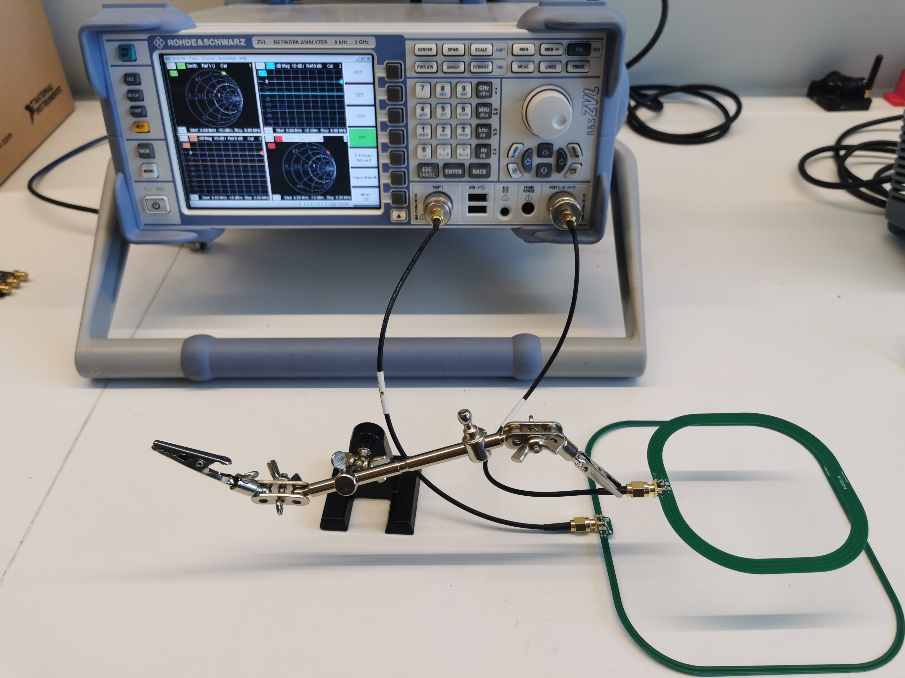

# Coil Coupling Factor Reading with VNA
Via python script and the python library *rohdeschwarz.instruments.vna*, the VNA equipment can be accessed and configured with *SCPI* commands.
The S-paramaters can be converter to Z-parameters and consequently to the required coupling factor *k*.

| Used VNA Equipment ||
|-|-|
| Manufacturer | Rohde&Schwarz |
| Model | ZVL-3 |
| Serial_no | 1303.6509K03/102211 |
| Firmware_ver | 3.31 |

